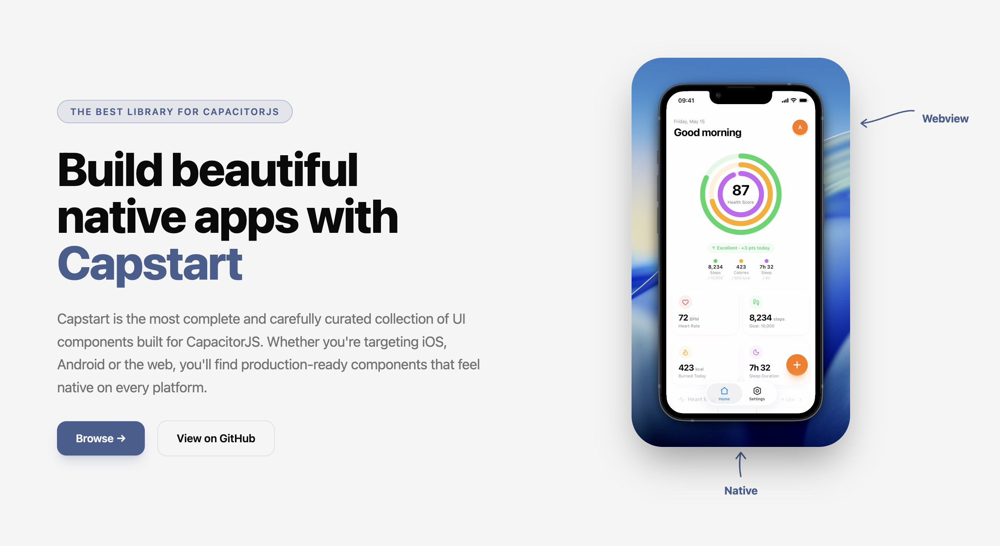

# Capstart



Capstart is a web-first toolkit for building polished mobile apps with **CapacitorJS**.

---

## What's in this repo

This monorepo contains **three independent products**. Pick the one that fits your situation:

| Product | What it does | When to use it |
|---|---|---|
| [`cli/`](./cli/) | Adds Capacitor to an **existing** web project | You already have a Next.js / Nuxt / React / Svelte / Vue app |
| [`capstart-boilerplate/`](./capstart-boilerplate/) | Starter app to build from scratch | You're starting a new mobile app and want auth/UI already wired |
| [`capstart-website/`](./capstart-website/) | Documentation website | You're contributing to the docs or running them locally |

---

## CLI — `npx capstart init`

Adds Capacitor to an existing web project. Supports Next.js, Nuxt, React + Vite, Svelte + Vite, SvelteKit, TanStack Start, and Vue.

```bash
npx capstart init ..
```

The CLI detects your framework, configures the native app id/name, installs Capacitor, adds native iOS/Android projects, builds your web app, and runs `cap sync`. In interactive mode it also offers a **minimal** or **recommended** plugin setup.

→ [CLI README](./cli/README.md)

---

## Boilerplate — start a new mobile app

A ready-to-ship starter with:

- React 19 + Vite + TypeScript
- Capacitor 8 configured through Capstart CLI
- Supabase auth wiring (login, session, protected routes)
- Tailwind CSS v4 + shadcn/ui
- Mobile-first layout with safe-area handling

```bash
cd capstart-boilerplate
bun install
bunx capstart@latest init . --framework react-vite --setup recommended --safe-area --app-id com.example.myapp --app-name "My App"
bun run dev
```

→ [Boilerplate README](./capstart-boilerplate/README.md) for the complete setup and native sync/build steps.

---

## Website — documentation

The official docs site for Capstart patterns and components. Built with React 19, TanStack Router, Fumadocs, Tailwind CSS 4, and deployed on Cloudflare Workers.

```bash
cd capstart-website
bun install
bun run dev
# → http://localhost:3000
```

→ [capstart-website/content/docs/](./capstart-website/content/docs/) for MDX content.

---

## What Capstart covers

Capstart follows one principle: keep product UI and routing in the web layer, add native surfaces only when they materially improve mobile UX.

Covered patterns:

- Navigation bars and tab bars
- Page transitions
- Social login and authentication bridges
- In-app purchases and subscriptions
- Advanced iOS surfaces (Live Activities, widgets)

---

## Common Commands

### CLI

```bash
cd cli
bun run typecheck
bun test
bun run build
```

### Website

```bash
cd capstart-website
bun run dev
bun run build
bun run deploy   # Cloudflare Workers
bun run lint
bun run types:check
```

### Boilerplate

```bash
cd capstart-boilerplate
bun run dev
bun run build
bun run lint
```

---

## Contribution Guidelines

1. Guide/content changes → edit files in `capstart-website/content/docs/*.mdx`.
2. New docs pages → update `capstart-website/content/docs/meta.json`.
3. Starter improvements → update `capstart-boilerplate/` and keep its README in sync.
4. Run the relevant checks before opening a PR, and explain intent + impact in the PR description.

---

## Links

- CapacitorJS: https://capacitorjs.com
- Fumadocs: https://fumadocs.vercel.app

## License

[MIT](./LICENSE)
